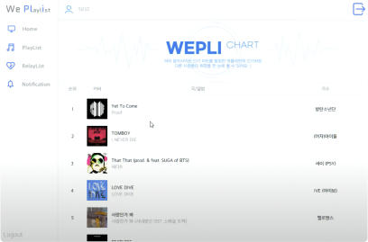
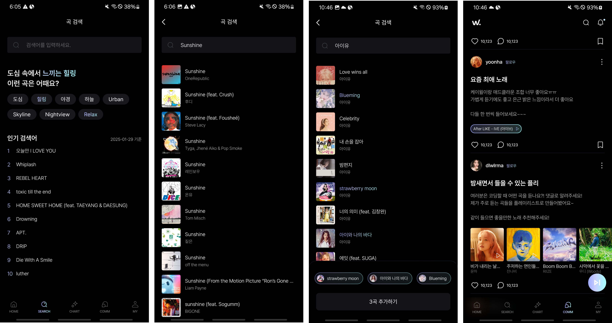

<!-- truncate -->

이 글에서는 WePLi에서 음악 API를 선택하고 활용한 과정을 소개합니다.  
특히 Apple Music API를 선택한 이유와 활용 예시를 중점으로 다룰 예정입니다.

### 음악 데이터 구축의 필요성

음악 관련 서비스에서 음악 검색 기능은 필수적인 요소입니다.  
하지만 개인이 1억 개 이상의 곡과 지속적으로 추가되는 신곡 데이터를 직접 구축하는 것은 현실적으로 어렵습니다.

WePLi의 초기 버전(Java Swing)에서는 여러 음악 플랫폼의 인기 차트를 통합하여 제공하는 기능을 고려했었습니다. 하지만 국내 플랫폼(멜론, 지니, 벅스 등)은 공식적은 API를 제공하지 않아, 크롤링을 이용해야 했습니다.

    
    

        WePLi(Java Swing) 차트 화면
    

당시에는 서비스 배포 계획이 없었기 때문에 크롤링 방식이 문제가 되지 않았지만, 현재의 WePLi 앱은 공식적으로 배포될 예정이므로 안정적이고 법적 문제가 없는 공식 API가 필요했습니다.

이 글에서는 음악 API를 선택하는 과정과 고려 사항을 정리하고, Apple Music API를 어떻게 활용했는지 소개하겠습니다.

 

### 음악 API 선택시 고려했던 것들

WePLi는 단순 음악 검색 기능뿐만 아니라 사용자 간 공유, 게시글에 노래 첨부 등 다양한 기능을 제공합니다.
이러한 기능을 구현하기 위해 적절한 음악 API를 찾기 시작했습니다.

음악 API를 선택할 때 고려한 기준은 다음과 같습니다.

- **필수 조건**  
• 검색 기능 제공  
• 한국 노래 지원  
• 무료 또는 저렴한 비용  

- **부가 조건**  
• 추천 서비스 제공(검색어,플레이리스트 등)  

위 조건으로 API를 찾던 중, 가장 흔히 사용되는 API 서비스 2개가 눈에 들어왔습니다.

- • Spotify API [[링크]](https://developer.spotify.com/terms)
- • Apple Music API [[링크]](https://developer.apple.com/documentation/applemusicapi)

 

### Spotify API vs Apple Music API 비교

|                 |   Spotify   | Apple Music |
|-----------------|-------------|-------------|
| 검색 기능 제공 여부 | O            | O           |
| 국내 노래 제공 여부 | X (영어로 제공) | O           |
| 가격             | 무료          | 연 13만원     |

Spotify API는 방대한 데이터와 무료라는 큰 장점이 있지만, 국내 노래가 한글로 지원 되지 않는다는 큰 단점이 있었습니다.
아무래도 국내보단 해외에서 많이 사용되는 서비스이기 때문에 가수들이 노래를 등록할 때 영어로 등록을 많이하는 것 같습니다.

#### Spotify API의 단점
1. • 한국 노래가 영어로 등록 되어있음 -> 검색 및 사용자 경험 저하
2. • Spotify 로그인이 필수 -> Spotify를 사용하지 않는 유저에겐 허들로 느껴질 수 있음

WePLi의 주요 타겟층은 **국내 트렌드에 민감한 10-20대** 사용자입니다.  
10-20대가 주 타겟층인 앱에서 대부분의 노래가 영어로만 제공이 된다면 **앱의 매력이 크게 감소할 것**이라 판단했습니다.

결과적으로 **조금 더 완성도 높은 사용자 경험을 제공하기 위해** 연 13만원의 비용을 지불하더라도 Apple Music API를 선택하였습니다.

 

### Apple Music API 활용

WePLi에선 Apple Music API를 활용하여 다음과 같은 기능을 구현했습니다.

• **음악 검색 기능**

   - 사용자가 원하는 노래를 검색하면, Apple Music API에서 제목, 아티스트, 앨범 정보, 썸네일 이미지 등을 가져옵니다.
   - 검색 결과를 기반으로 사용자가 쉽게 곡을 추가하고 공유할 수 있도록 UI를 구성했습니다.

• **인기 차트**

   - Apple Music의 인기 차트 데이터를 가져와 실시간으로 트렌드 곡을 제공합니다.
   - 사용자가 현재 인기 있는 곡을 쉽게 확인할 수 있도록 구현되었습니다.

• **인기 검색어**

   - Apple Music API를 활용해 사용자들이 많이 검색하는 키워드를 분석하여 제공하는 기능입니다.
   - 이를 통해 사용자는 현재 유행하는 음악을 쉽게 찾을 수 있습니다.

 

### 마무리

WePLi는 사용자 경험을 최우선으로 고려하여 Apple Music API를 선택했습니다.  
비용적인 부담은 있지만, 보다 완성도 높은 음악 검색 및 공유 기능을 제공할 수 있다는 점에서 충분히 가치 있는 선택이라고 판단했습니다.

앞으로도 API를 활용한 기능을 확장하면서, 더 나은 사용자 경험을 제공할 계획입니다.  
다음 글에서는 Apple Music API를 실제로 적용한 코드 및 구현 방법을 상세히 다뤄보겠습니다.

긴 글 읽어주셔서 감사합니다 🎵