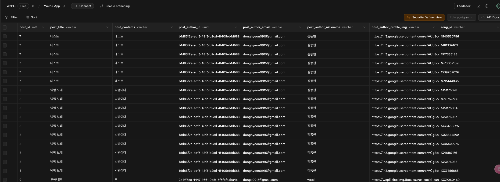
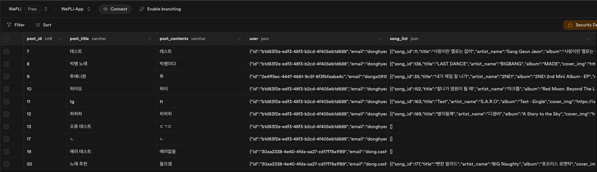

Supabase를 사용하면서 View를 사용했을 때의 문제점을 소개합니다.

<br/>
<br/>
{/* truncate */}

WePLi는 현재 서버 프레임워크 없이 Supabase만을 활용해 개발 중입니다.  

Supabase는 서버가 없는 동안 임시 대체제로 사용되고 있으며, 추후 실제 서버로 전환할 예정입니다.  
**Supabase를 서버로 전환할 때 앱에는 최대한 영향이 없어야한다는 목표**를 가지고 개발에 임하고 있습니다.

앱에 영향이 없으려면 Supabae에서 실제 서버의 응답 구조와 비슷하게 구성을 해야하는데,  
여기서 한 가지 문제점이 존재합니다.  

관계형 데이터베이스는 기본적으로 **평면적인 테이블 구조**를 사용하기 때문에 **계층 데이터를 표현하기 어렵습니다.**  
이로 인해 Supabase의 응답 형식과 실제 서버의 응답 구조 사이에 차이가 발생하며, 이 차이가 클수록 실제 서버 전환 시 앱 코드 수정 사항이 많아집니다.

이 글에서는 기존 View 방식의 한계와, **PostgreSQL**의 ***JSON Aggregation*** 기능을 활용하여 계층형 데이터 뷰를 구성하는 방법을 소개합니다.


### 기존 View 생성 방식과 그 한계

일반적으로 View를 생성할 때는 여러 테이블을 JOIN하여 단순한 평면(Flat) 구조의 데이터를 반환합니다.

예를 들어, **게시글(post)** 에 **작성자(user)** 와 **수록곡(song)** 정보를 함께 포함시키는 경우, 아래와 같이 View를 정의할 수 있습니다.

```sql
CREATE VIEW post_view AS
  SELECT
    p.id AS post_id,
    p.title AS post_title,
    p.contents AS post_contents,
    u.id AS post_author_id,
    u.email AS post_author_email,
    u.username AS post_author_nickname,
    u.profile_img AS post_author_profile_img,
    s.song_id AS song_id,
    s.title AS song_title,
    s.artist_name AS song_artist,
    s.album AS song_album,
    s.cover_img AS song_cover,
    s.href AS song_href,
    s.duration_millis AS song_duration
FROM posts p
  LEFT JOIN public.user u ON p.author = u.id
  LEFT JOIN post_bside_track pbt ON p.id = pbt.post_id
  LEFT JOIN song s ON pbt.song_id = s.id;
```

<br/>

### 주요 문제점

1. 계층적 데이터 표현의 부재

    

    - 게시글 하나에 여러 수록곡(song)이 포함되어 있으면, 각각의 수록곡마다 게시글 정보가 반복되어 반환됩니다.  
      예시) 게시글 1에 수록곡 3개가 있다면, 동일한 게시글 정보가 3번 반복됨


2. 네트워크 사용량 증가
    - 데이터가 중복되어 전송되므로, 네트워크 사용량과 클라이언트 메모리 부담이 증가하며, 안드로이드 앱에서 파싱 및 가공하는 과정이 복잡해집니다.

3. 서버 마이그레이션 및 API 변경 시 추가 공수 발생
    - 서버 API는 일반적으로 계층적 구조로 데이터를 제공하므로, 이후 실제 서버로 마이그레이션시 수정이 불가피합니다.


### Json Aggregation을 활용한 계층형 View 생성 방식

관계형 DB에서 계층 구조로 데이터를 표현하는 방법 중 하나는 JSON을 이용하는 것입니다.

PostgreSQL의 JSON 함수(json_agg, json_build_object)를 활용하면 데이터베이스에서 미리 계층형 구조의 데이터를 만들어 클라이언트에 전달할 수 있습니다.

#### 구현 예시

아래 코드는 각 게시글에 포함된 수록곡 정보를 JSON 배열로 집계하여, 게시글과 작성자 정보와 함께 계층형 데이터를 반환하는 View를 생성하는 예시입니다.

```sql
CREATE OR REPLACE VIEW post_tree_view as
  WITH song_agg AS (
    SELECT
      pbt.post_id,
      json_agg(
        json_build_object(
          'song_id', s.id,
          'title', s.title,
          'artist_name', s.artist_name,
          'album', s.album,
          'cover_img', s.cover_img,
          'href', s.href,
          'duration_millis', s.duration_millis
        )
      ) AS song_list
    FROM post_bside_track pbt
    LEFT JOIN song s ON pbt.song_id = s.id
    GROUP BY pbt.post_id
  )
  SELECT
    p.id AS post_id,
    p.title AS post_title,
    p.contents AS post_contents,
    json_build_object(
      'id', u.id,
      'email', u.email,
      'username', u.username,
      'profile_img', u.profile_img
    ) AS "user",
    COALESCE(s.song_list, '[]'::json) AS song_list
  FROM posts p
  LEFT JOIN public.user u ON p.author = u.id
  LEFT JOIN song_agg s ON p.id = s.post_id;

```


**실제 출력 결과**



리스트 형태의 데이터가 Json으로 하나의 필드에 포함된 것을 볼 수 있습니다.  
이렇게 불필요한 데이터 반복을 줄이고 필요한 데이터만 출력이 가능합니다.

**예시 응답 결과**

```json
{
  "post_id": 1,
  "post_title": "게시글 제목",
  "post_contents": "게시글 내용",
  "user": {
     "id": 123,
     "email": "user@example.com",
     "username": "작성자닉네임",
     "profile_img": "이미지 URL"
  },
  "song_list": [
     {
       "song_id": 10,
       "title": "노래 제목",
       "artist_name": "아티스트 이름",
       "album": "앨범명",
       "cover_img": "커버 이미지 URL",
       "href": "노래 링크",
       "duration_millis": 210000
     },
     ...
  ]
}
```


### 안드로이드 입장에서의 Json 기반 View 활용 장점

1. 네트워크 효율성 (데이터 전송 최적화)
    - 중복 데이터 전송이 줄어들어 데이터 사용량이 절감됨
    - 네트워크 비용 측면(데이터 사용량)에서도 효율적

2. 응답 매핑 로직 간소화
    - Domain 모델의 구조와 API 응답 구조가 비슷할수록 매핑 로직이 간소화 됨
    - 평면 데이터에서 계층 구조로의 재구성이 필요 없으므로 개발 생산성이 향상됨

3. 유지보수 및 확장성
	- 서버 API 변경이나 마이그레이션 시, 계층형 데이터 구조를 유지함으로써 클라이언트 코드 변경 부담이 줄어듦


### 결론

Supabase와 PostgreSQL의 JSON Aggregation 기능을 활용하여 계층형 데이터를 미리 구성함으로써, 안드로이드 앱 개발에서 네트워크 최적화 및 클라이언트 로직 단순화라는 이점을 얻을 수 있었습니다.

서버 대신 Supabase를 이용해서 개발을 하시는 분들이 있다면 해당 글을 참고해서 활용해보시면 좋을 것 같습니다.